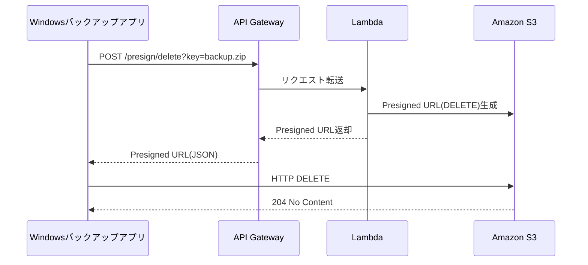

# ファイル削除時

```mermaid

sequenceDiagram
    participant App as Windowsバックアップアプリ
    participant API as API Gateway
    participant Lambda as Lambda
    participant S3 as Amazon S3

    App->>API: POST /presign/delete?key=backup.zip
    API->>Lambda: リクエスト転送
    Lambda->>S3: Presigned URL(DELETE)生成
    Lambda-->>API: Presigned URL返却
    API-->>App: Presigned URL(JSON)

    App->>S3: HTTP DELETE
    S3-->>App: 204 No Content
```
