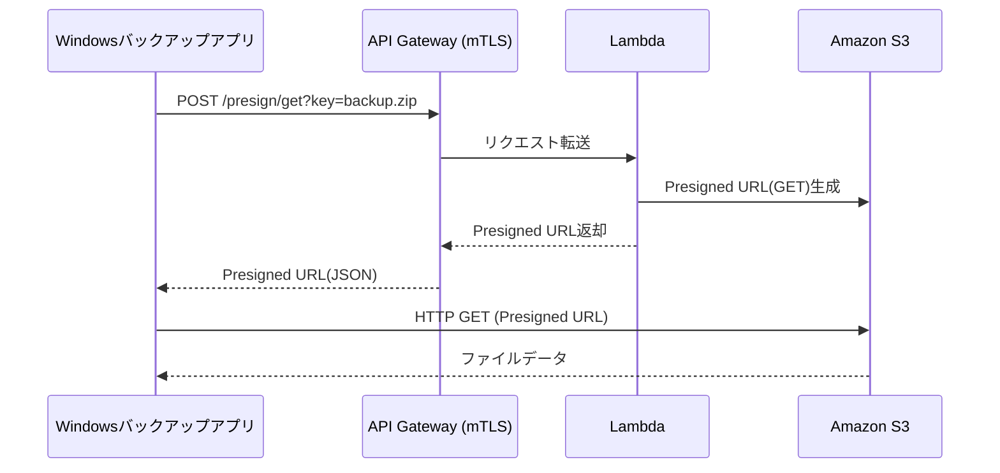

# ファイルダウンロード時

```mermaid

sequenceDiagram
    participant App as Windowsバックアップアプリ
    participant API as API Gateway (mTLS)
    participant Lambda as Lambda
    participant S3 as Amazon S3

    App->>API: POST /presign/get?key=backup.zip
    API->>Lambda: リクエスト転送
    Lambda->>S3: Presigned URL(GET)生成
    Lambda-->>API: Presigned URL返却
    API-->>App: Presigned URL(JSON)

    App->>S3: HTTP GET (Presigned URL)
    S3-->>App: ファイルデータ
```
