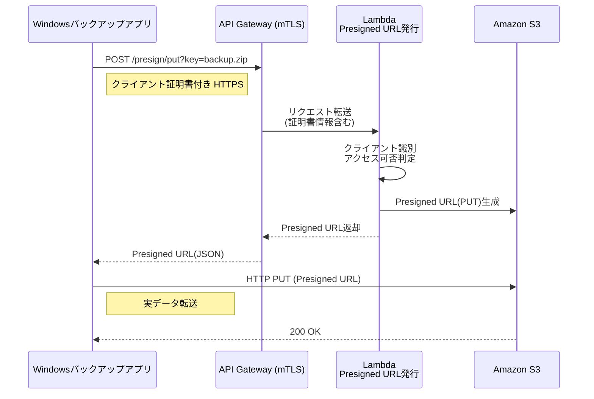

# ファイルアップロード時

```mermaid

sequenceDiagram
    participant App as Windowsバックアップアプリ
    participant API as API Gateway (mTLS)
    participant Lambda as Lambda<br/>Presigned URL発行
    participant S3 as Amazon S3

    App->>API: POST /presign/put?key=backup.zip
    note right of App: クライアント証明書付き HTTPS

    API->>Lambda: リクエスト転送<br/>(証明書情報含む)
    Lambda->>Lambda: クライアント識別<br/>アクセス可否判定
    Lambda->>S3: Presigned URL(PUT)生成
    Lambda-->>API: Presigned URL返却
    API-->>App: Presigned URL(JSON)

    App->>S3: HTTP PUT (Presigned URL)
    note right of App: 実データ転送
    S3-->>App: 200 OK
```
