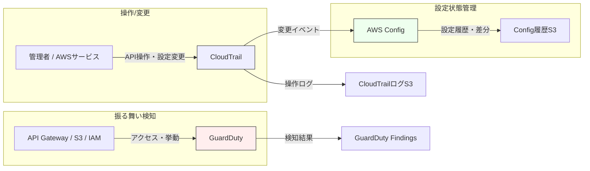

# セキュリティ設計

## 1. 目的と基本方針

本章では、本システムにおけるセキュリティ設計の全体方針および各対策の位置づけを定義する。
本システムは、オンプレミス（Windows端末）から Amazon S3 へ医療情報を含むバックアップデータを保存することを目的としており、以下を最優先とする。

- 通信経路および保存データの高い機密性・完全性の確保
- 不正アクセスおよび設定ミスの抑止
- 監査・説明責任を果たせるログおよび証跡の確保

本設計では「過剰な多重防御による運用複雑化」を避け、役割が明確に分離されたサービスのみを採用する。

---

## 2. セキュリティ全体構成と責務分担

### 2.1 セキュリティレイヤ別の責務

| 区分 | 主なサービス | 役割 |
|---|---|---|
| 認証・通信 | ACM / ACM Private CA / API Gateway | mTLS による端末認証、通信の完全性確保 |
| アクセス制御 | Presigned URL / S3 バケットポリシー | データアクセスの最小化 |
| 検知 | GuardDuty | 不審・異常挙動の検知 |
| 証跡 | CloudTrail / AWS Config | 操作履歴・設定変更履歴の記録 |
| 人の操作管理 | IAM Identity Center | 管理者操作の一元管理 |

---

## 3. 認証・通信セキュリティ設計

### 3.1 API 通信（制御系）

- TLS バージョン：TLS 1.3
- 認証方式：mTLS（双方向 TLS）
- クライアント証明書：ACM Private CA により発行
- API Gateway にてクライアント証明書を検証

### 3.2 データ通信（データ系）

- 通信方式：HTTPS（AWS 標準 TLS）
- クライアントと S3 は直接通信
- Lambda / API Gateway はデータ転送を中継しない

---

## 4. 認証・識別設計

- IAM ユーザーは使用しない
- Windows 端末はクライアント証明書の CN により識別
- Lambda にて CN を取得し、アクセス可否および対象 S3 バケットを判定

---

## 5. データアクセス制御（S3）

### 5.1 アクセス方式

- S3 への操作は Presigned URL のみを許可
- Presigned URL は Lambda が発行
- URL の有効期限は最小限とする

### 5.2 S3 セキュリティ設定

- Block Public Access：有効
- 暗号化：SSE-KMS
- バージョニング：有効

---

## 6. 監査・ログ・検知設計

### 6.1 CloudTrail

- 管理イベントを全リージョンで取得
- S3 データイベントを取得
- ログファイル検証を有効化
- ログ保存用 S3 バケットは SSE-KMS により暗号化

### 6.2 GuardDuty

- 全リージョンで有効化
- S3 Protection を有効化
- 初期段階では通知は行わず、検知結果の確認に留める

---

## 7. AWS Config 設計

### 7.1 位置づけ

AWS Config は侵入検知や脆弱性検知を目的とせず、設定変更の履歴および設定逸脱の有無を記録するために使用する。
主に監査対応および運用ミスの事後追跡を目的とする。

### 7.2 基本方針

| 項目 | 方針 |
|---|---|
| 記録対象 | 重要リソースのみ |
| ルール | AWS マネージドルールのみ |
| 通知 | 初期は無効 |
| 自動修復 | 実施しない |

### 7.3 記録対象リソース

- Amazon S3（バケット、ポリシー、Public Access Block）
- IAM（ロール、ポリシー）
- CloudTrail（Trail）
- AWS KMS（カスタマー管理キー）

### 7.4 Config ルール一覧

#### S3

- s3-bucket-public-read-prohibited
- s3-bucket-public-write-prohibited
- s3-bucket-server-side-encryption-enabled

#### IAM

- iam-policy-no-statements-with-admin-access
- iam-root-access-key-check
- iam-user-no-policies-check

#### CloudTrail

- cloudtrail-enabled
- cloudtrail-log-file-validation-enabled

#### KMS

- kms-key-enabled
- kms-key-not-scheduled-for-deletion

### 7.5 対象外とする項目

- Lambda
- API Gateway
- Route 53
- GuardDuty / Inspector

---

## 8. 管理者アクセスおよび運用セキュリティ

- AWS 管理操作は IAM Identity Center を利用
- 管理者・運用者・監査者の権限を分離
- ルートアカウントは初期設定以外で使用しない

---

## 9. 追加セキュリティ対策（補足）

| サービス | 方針 |
|---|---|
| AWS Shield Standard | 自動有効（DDoS 基本対策） |
| S3 Access Analyzer | 外部公開経路の可視化目的で利用 |
| Inspector | Lambda のみ対象、必要に応じて導入 |
| Security Hub | 初期構築段階では導入しない |

---

## 10. Config / CloudTrail / GuardDuty の関係図（責務整理）

本システムにおける CloudTrail・AWS Config・GuardDuty は、それぞれ役割が明確に分離されており、相互に補完関係を持つ。
以下に責務整理を目的とした関係図を示す。

---

### 10.1 各サービスの役割整理

| サービス | 主な役割 | 本構成での位置づけ |
|---|---|---|
| CloudTrail | API操作・管理イベントの記録 | 誰が・いつ・何をしたかを記録する証跡 |
| AWS Config | 設定状態と変更履歴の保持 | 設定逸脱・変更内容の可視化 |
| GuardDuty | 不審な挙動・脅威検知 | 侵害・乱用の兆候を早期に検知 |

---

### 10.2 設計上の重要ポイント

- CloudTrail が "事実（イベント）" を記録する
- AWS Config が "状態（設定のあるべき姿）" を保持する
- GuardDuty が "振る舞い（異常兆候）" を検知する

これらを併用することで、

- **操作証跡**（CloudTrail）
- **設定変更の説明責任**（AWS Config）
- **侵害・不正の早期検知**（GuardDuty）

をそれぞれ独立して担保する。

---

## 11. まとめ

本システムでは、mTLS および Presigned URL を中心とした強固な通信・アクセス制御を基盤とし、CloudTrail・AWS Config・GuardDuty を役割分担させて組み合わせることで、医療情報を扱うシステムとして必要な防御・検知・証跡の三要素を過不足なく実装する。
